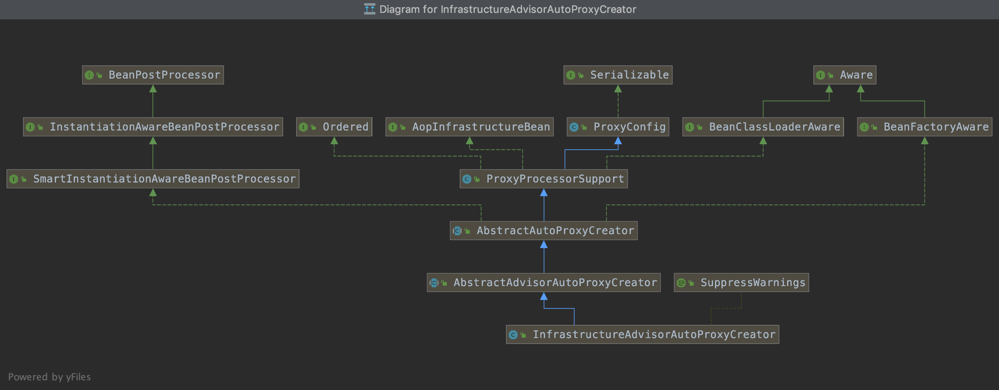

# 当日总结

> Date 10.02pm ~ 12.35pm

## Today list

* 声明式事务源码解析

## Yesterday not finished

* 全部完成

## Point

### maven命令行手动私服提交方法（适用于非项目包提交，如无外网环境）

```shell
mvn deploy:deploy-file -DgroupId=com.xiaomi -DartifactId=mipush-sdk -Dversion=2.2.19 -Dpackaging=jar -Dfile=MiPush_SDK_Server_2_2_19.jar -Durl=http://192.168.10.131:8081/repository/maven-releases/  -DrepositoryId=nexus-snapshots
```

可以用mvn --help 命令查看所有有关的命令

### @EnableTransactionalManager

1. 利用TransactionManagementConfigurationSelector 给容器中注入bean，导入2个组件:
   * AutoProxyRegistrar
   * ProxyTransactionManagementConfiguration
2. AutoProxyRegistrar
    `InfrastructureAdvisorAutoProxyCreator`  给容器中注册一个这个组件
    > 类uml图中可以看出,这个组件和aop中的实现很类似

    

    该组件利用后置处理器在对象创建之后，返回一个代理对象，代理对象执行方法利用拦截器链进行调用
3. ProxyTransactionManagementConfiguration
   1. 给容器中添加事务增强器
       * 事务增强器要用到事务的注解信息,用AnnotationTransactionAttributeSource，解析事务的注解参数
       * 事务拦截器 TransactionInterceptor ,保存了事务属性，事务管理器，是一个 `MethodInterceptor` ，在目标方法执行的时候执行拦截器链。
  
            ```java
            TransactionAttribute txAttr = tas != null ? tas.getTransactionAttribute(method, targetClass) : null;
            PlatformTransactionManager tm = this.determineTransactionManager(txAttr);
            ```

            1. 先获取事务的属性
            2. 获取`PlatformTransactionManager`，如果事先没有添加，则从ioc中获取PlatformTransactionManager,
            3. 执行目标方法,如果异常，获取到事务管理器，利用事务管理器回滚这次操作。如果正常，利用事务管理器，提交事务。
