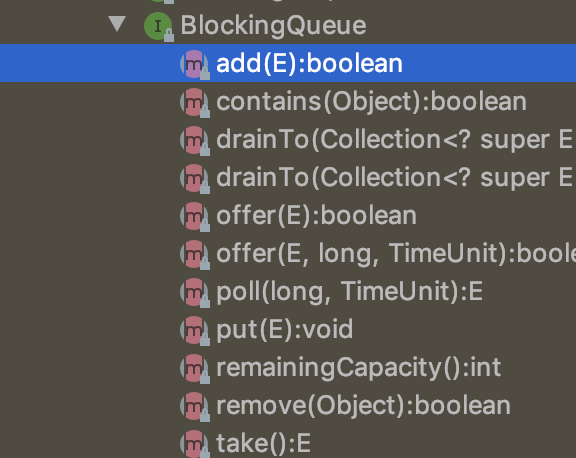

# 当日总节

> Date 10.44pm ~ 12.28pm

## TODAY  list

* 看spring高级属性之beanfactory

## Yesterday not finished

* 国庆假日还是有点长了,可惜国庆的时候竟然没有一点学习的欲望。就这么玩了7天

## Point

### 多线程介绍

java并发大神`Doug Lea`编写的concurrent包，其中核心就是`BlockingQueue`  无论是哪个队列都是实现了这个接口.
>源码一览



其中 `add` 多用在无界队列的添加过程中，表示在插入的时候会返回boolean值,要是没有空间直接抛出异常.`offer`和它的重载方法多用在有界队列和设置了超时时间的队列中，`put`一般是插入,要是没有空间会进行等待.`poll`该方法获取并移除此队列的头元素，若队列为空，则返回 null,在多个线程

    Retrieves and removes the head of this queue, waiting if necessary until an element with an expired delay is available on this queue,
    or the specified wait time expires.

`take` 用于获取当前线程，然后是与多线程相关的2个重要的对象：

#### ReentrantLock重入锁

1. 重入锁就是指1个线程能够多次获取这个锁
2. 重入锁有公平锁和非公平锁2个策略，其中非公平锁在资源占用上比公平锁小，因为有时候唤醒一个线程所消耗的资源可能还超过了线程执行中占用的资源了。
3. 重入锁中有`lock`和`trylock`2种方式去获取锁，第一种的情况下要是获取锁失败的时候会挂起等待锁释放，第二种的情况下则会直接返回false
4. 解锁的方式就是调用`unlock`这个方法，一般在finally中执行。

##### Condition

1. condition通常配合重入锁使用

    ```java
        /**
     * Condition signalled when a newer element becomes available
     * at the head of the queue or a new thread may need to
     * become leader.
     */
    private final Condition available = lock.newCondition();
    ```

    用于线程的调度。
1. 其中使用到的主要方法是`signal()`唤起和`await()`等待，其中等待的方法可以加上等待时间让它自动不可用。

### 线程池中的几个阻塞队列

* ArraryBlockQueue
* LinkedBlockQueue
* DelayQueue
* PriorityBlockingQueue
* LinkedTransferQueue
* SynchronousQueue
* LinkedBlockingDeque

源码解析目前没有看完，等过几天，这几个阻塞队列要一个一个过。
