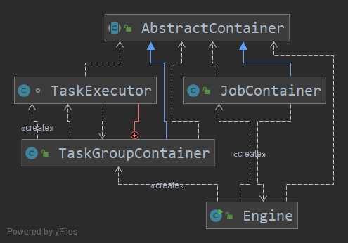

# 当日总节

> Date 11.40 pm

## 总体流程图

先看执行的第一个步骤:



在最上层抽象类,这个里面相当于获取全局公共信息,java入口部分就是这个Engine的main方法直接启动

## Engine 启动

### com.alibaba.datax.core.Engine#main直接启动

阿里这边有提供多级JSON配置信息无损存储
```
com.alibaba.datax.common.util.Configuration
```
但是平常的使用中很少有直接以json的格式操作,一般是转成对象bean,然后进行操作,
他在这边新写这个方法的目的主要在于对封闭的json进行处理,直接从key获取到value,但是我感觉还是可以直接转成bean的形式去获取比较方便.毕竟只有一个json的文件

直接main方法启动,在datax.py脚本中设置了锁需要的参数和json地址, 在启动的时候通过读取启动参数,获取到当前的启动配置文件.
这边阿里使用了
```
<dependency>
    <groupId>commons-cli</groupId>
    <artifactId>commons-cli</artifactId>
    <version>1.3.1</version>
</dependency>
```
这个包 ,然后使用
```
Options options = new Options();
		options.addOption("job", true, "Job config.");
		options.addOption("id", true, "Job unique id.");
		options.addOption("mode", true, "Job runtime mode.");
		DefaultParser parser = new DefaultParser();
		CommandLine cl = parser.parse(options, args);
		String job = cl.getOptionValue("job");
		String id = cl.getOptionValue("id");
		String mode = cl.getOptionValue("mode");
```
来根据参数的名字进行读取.这个地方平常很少有用到,可以记录下.

datax在执行的过程中打了很多的日志,有个打印vminfo的class我感觉可以在平常使用到,之前我也写过这种类似的,但是说效果不是很好,因为我之前是使用的脚本去查询的服务器上面的信息.
```
com.alibaba.datax.common.statistics.VMInfo#getVmInfo
```
这个类的话,在日志监控或者效率监控也可以使用到.

### com.alibaba.datax.core.Engine#start 进入真正的执行方法
