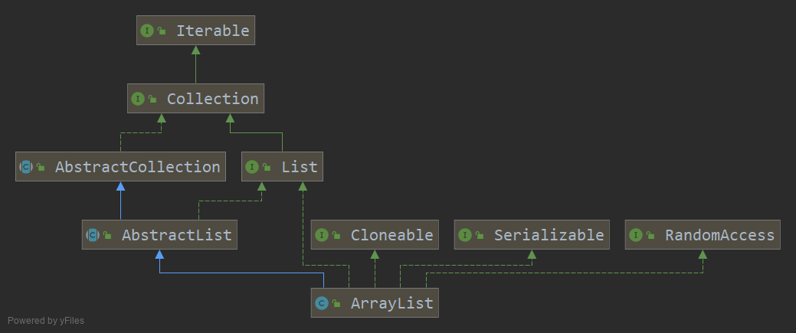

# 当日总节

> Date 19.38 

# point

## ArrayList

### 接口类和父类



#### 父类:

##### AbstractList:
主要是为了让list有序,从这个`AbstractList`中可以引申一个问题'foreach遍历ArrayList时新增或删除后导致报错的原因'

使用foreach,必须是要实现了Iterable<T>接口的对象,ArrayList在foreach循环的时候,本质上调用的是`ArrayList`的iterator的whilehasnext的循环
,不过是在编译过程中直接转成的

```java
        Iterator var2 = list.iterator();

        while(var2.hasNext()) {
            String s = (String)var2.next();
            System.out.println(s);
        }
```
,如果我们在foreach循环里面进行remove(),那么在class文件中就会变成这样

```java
     Iterator var2 = list.iterator();

        while(var2.hasNext()) {
            String s = (String)var2.next();
            System.out.println(s);
            list.remove(1);
        }
```
可以看出是调用的list的remove方法而不是Iterator中的方法.

##### `list.iterator()`

```java
    public Iterator<E> iterator() {
        return new Itr();
    }
```

直接new 了一个Itr的对象,这个也可以说明,在并发中用foreach,在不对list修改的时候,是线性安全的,因为它每次foreach都是new了一个对象,然后对这个对象进行while循环.

##### `var2.next()`

```java
       public E next() {
           //检查Itr中new的时候获取到的原被结构修改次数是否还能等于AbstractList的被结构修改次数
           // 不等于的话直接抛异常
            checkForComodification();
            try {
                int i = cursor;
                //获取当前index的对象
                //这个里面会有数组越界检查
                E next = get(i);
                //当前index设置为i
                lastRet = i;
                //下一index设置为i+1
                cursor = i + 1;
                return next;
            } catch (IndexOutOfBoundsException e) {
                //再次检查,看是不是由于被结构修改导致的异常
                checkForComodification();
                throw new NoSuchElementException();
            }
        }
```

##### `var2.remove()`

```java
   public void remove() {
            if (lastRet < 0)
                throw new IllegalStateException();
            checkForComodification();

            try {
                AbstractList.this.remove(lastRet);
                if (lastRet < cursor)
                    cursor--;
                lastRet = -1;
                expectedModCount = modCount;
            } catch (IndexOutOfBoundsException e) {
                throw new ConcurrentModificationException();
            }
        }
```
itr中删除就不会导致之前的问题,因为在这边进行删除之后会对修改次数重新进行一次赋值.

#### 接口部分

- List        
- RandomAccess 在提供了更快的循环方式的list上面会实现这个接口, 一个打标的接口.
- Cloneable　list提供的克隆属于浅克隆部分,The elements themselves are not copied.
- Serializable 序列化部分


#### 成员变量

* DEFAULT_CAPACITY = 10  默认容量大小
* EMPTY_ELEMENTDATA 在空实例中共享这个空数组
* DEFAULTCAPACITY_EMPTY_ELEMENTDATA 默认大小的空数组,用这个和EMPTY_ELEMENTDATA对比来鉴别出,当添加了第一个元素的时候会导致数组会膨胀多大.
* elementData 这个是反序列化变量,存储ArrayList元素的数组缓冲区.ArrayList的容量是此数组缓冲区的长度。添加第一个元素时，任何具有elementData == DEFAULTCAPACITY_EMPTY_ELEMENTDATA 的空ArrayList的容量都将扩展为DEFAULT_CAPACITY。
* size 数据容量大小
* MAX_ARRAY_SIZE 最大arraysize,是静态私有变量,-8是为了有些vm在处理的时候保留了head前面8位.超出会报异常

#### 构造方法

* ArrayList(int initialCapacity) initialCapacity容量的list
* ArrayList() 默认DEFAULT_CAPACITY 
* ArrayList(Collection<? extends E> c)

    在这个地方有个java修了10年的bug(因为是p3级别,see 6260652),在jdk9中才正式修正,具体描述就是在使用
    `Arrays.asList`构建的List,是Arrays内部类`ArrayList`而不是`java.util.ArrayList`,当调用这个list的`toArray()`方法,它字面返回的是Object[],然而当我们调用`arr.getClass().getCanonicalName()`的时候实际返回的是一个子类数组并不是 `Object[]` ,因为`toArray()`方法直接掉用的是`a.clone()`,而这个a是具体的一个类数组.并不是一个`Object[]`,当然在jdk9中就已经把这个地方改成了`Arrays.copyOf(a, a.length, Object[].class)`,所以不会有这个bug出现.  而我们在1.7,1.8中都是使用的`<T> T[] toArray(T[] a)`  这个方法,不会出现问题.不过现在知道了之后,在使用`toArray()`的时候要更加小心以免掉坑里.


#### 成员方法

##### 新增

新增流程为

1. 计算容量
2. modCount+1 
3. 扩容elementData
4. elementData的size++的值设置为当前传入的值
5. size+1

##### 删除

1. 检查传入的参数合法性
2. modCount+1 
3. 获取到当前的被删除的变量
4. 使用复制,将删除的index后面的全部往前移动一位
5. 将最后一位设置为空 等待gc

##### removeif

这个是java8中新增的一个方法,感觉设计的比较巧妙
1. new 了一个`BitSet`,将需要删除的对象放在了这个bitset里面
2. 先找到所有需要满足条件的index
3. 修改次数的判断
4. 判断是否需要删除
5. 将需要删除的对象全部挪到最后去
6. 将最后的需要删除的全部设置为空
7. 再次校验修改次数

其他不一一分析,感觉除了`writeObject`和`readObject`这2个io流相关的方法不怎么好理顺之外, 其他的都能读通顺.当然还有父类方法用的比较多的

#### 内部类

##### ArrayListSpliterator

ArrayList 提供的并行迭代器,主要是给stream用的

    并行分片迭代器是Java为了并行遍历数据源中的元素而专门设计的迭代器
    并行分片迭代器借鉴了Fork/Join框架的核心思想：用递归的方式把并行的任务拆分成更小的子任务，然后把每个子任务的结果合并起来生成整体结果
    并行分片迭代器主要是提供给Stream，准确说是提供给并行流使用，使用时推荐直接用Stream即可

##### Itr

迭代器,AbstractList.Itr的优化版本,单向移动

##### ListItr

可以选择从任意位置开始迭代,可以双向移动,然后重写了set和add方法,可以在迭代过程中执行

##### subList

* subList是返回list在指定起点和指定终点中的视图,对这个sublist中的值修改的时候也会改变原list中的值
* ArrayList.subList(int fromIndex, int toIndex)方法返回一个List: 此List的值包含fromIndex所在的值, 但不包含toIndex所在的值. 如果fromIndex等于toIndex, 那么会返回一个没有任何元素的空List. 返回的List支持java.util.List接口的所有操作.
* ArrayList.subList() 方法返回的List不能强转为ArrayList. ArrayList.subList() 方法返回的List实际类型是ArrayList的一个内部类SubList, 即java.util.ArrayList$SubList
* 如果原ArrayList对象有改动, 那么ArrayList.subList()方法返回的视图将会无效. 也就是说在操作ArrayList.subList()方法的返回值前不能对原ArrayList做任何修改, 否则你将得到一个java.util.ConcurrentModificationException异常.
