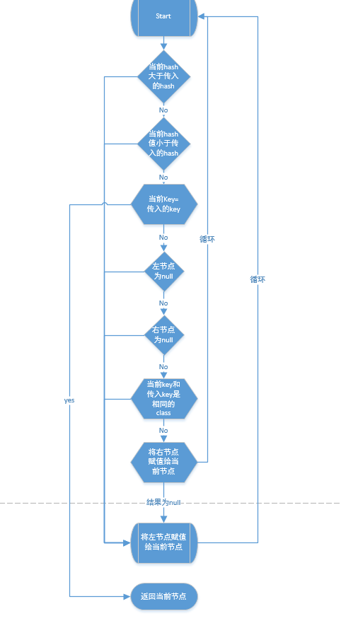

#  point 

## HashMap java8中实现

从结构实现来讲，HashMap是数组+链表+红黑树（JDK1.8增加了红黑树部分）实现的,在java8中新增对HashMap的优化在于,链路地址解决Hash冲突的时候,当链表长度超过8时,将其转为红黑树,时间复杂度由O(n)变为O(log n),当链表长度小于6的时候,再将其转为链表,目前需要探寻的就是转换的规律.

### 成员变量

```java
 /**
       初始化容量大小
     * The default initial capacity - MUST be a power of two.
     */
    static final int DEFAULT_INITIAL_CAPACITY = 1 << 4; // aka 16

    /**
       最大容量
     * The maximum capacity, used if a higher value is implicitly specified
     * by either of the constructors with arguments.
     * MUST be a power of two <= 1<<30.
     */
    static final int MAXIMUM_CAPACITY = 1 << 30;

    /**
       默认负载因子
     * The load factor used when none specified in constructor.
     */
    static final float DEFAULT_LOAD_FACTOR = 0.75f;

    /**
       默认转树节点数字 
     * The bin count threshold for using a tree rather than list for a
     * bin.  Bins are converted to trees when adding an element to a
     * bin with at least this many nodes. The value must be greater
     * than 2 and should be at least 8 to mesh with assumptions in
     * tree removal about conversion back to plain bins upon
     * shrinkage.
     */
    static final int TREEIFY_THRESHOLD = 8;

    /**默认转链表数字
     * The bin count threshold for untreeifying a (split) bin during a
     * resize operation. Should be less than TREEIFY_THRESHOLD, and at
     * most 6 to mesh with shrinkage detection under removal.
     */
    static final int UNTREEIFY_THRESHOLD = 6;

    /**
       当桶中bin被树化时最小的hash表容量.(若没有达到这个阈值,即hash表容量小于MIN_TREEIFY_CAPACITY
     * 当桶中bin数量太多时会执行resize扩容操作).这个MIN_TREEIFY_CAPACITY的值至少TREEIFY_THRESHOLD 
     * 的4倍。
     * The smallest table capacity for which bins may be treeified.
     * (Otherwise the table is resized if too many nodes in a bin.)
     * Should be at least 4 * TREEIFY_THRESHOLD to avoid conflicts
     * between resizing and treeification thresholds.
     */
    static final int MIN_TREEIFY_CAPACITY = 64;

     /** 节点数组
     * The table, initialized on first use, and resized as
     * necessary. When allocated, length is always a power of two.
     * (We also tolerate length zero in some operations to allow
     * bootstrapping mechanics that are currently not needed.)
     */
    transient Node<K,V>[] table;

    /** 保存缓存的entrySet（）,  KeySet（）和values（）使用AbstractMap字段。
     * Holds cached entrySet(). Note that AbstractMap fields are used
     * for keySet() and values().
     */
    transient Set<Map.Entry<K,V>> entrySet;

    /**
     * The number of key-value mappings contained in this map.
     */
    transient int size;

    /**修改次数,用来进行fail-fast机制的
     * The number of times this HashMap has been structurally modified
     * Structural modifications are those that change the number of mappings in
     * the HashMap or otherwise modify its internal structure (e.g.,
     * rehash).  This field is used to make iterators on Collection-views of
     * the HashMap fail-fast.  (See ConcurrentModificationException).
     */
    transient int modCount;

    /**下一个扩容的大小值
     * The next size value at which to resize (capacity * load factor).     
     * @serial
     */
    // (The javadoc description is true upon serialization.
    // Additionally, if the table array has not been allocated, this
    // field holds the initial array capacity, or zero signifying
    // DEFAULT_INITIAL_CAPACITY.)
    int threshold;

    /**
      负载因子(可以自定义传入)
     * The load factor for the hash table. 
     *
     * @serial
     */
    final float loadFactor;
```
### 内部类

#### Node节点

hashMap中也自己实现了Node节点

```java

    /**
     * Basic hash bin node, used for most entries.  (See below for
     * TreeNode subclass, and in LinkedHashMap for its Entry subclass.)
     */
    static class Node<K,V> implements Map.Entry<K,V> {
        //hashcode
        final int hash;
        //key
        final K key;
        //Value
        V value;
        //下一节点的信息
        Node<K,V> next;

        Node(int hash, K key, V value, Node<K,V> next) {
            this.hash = hash;
            this.key = key;
            this.value = value;
            this.next = next;
        }

        public final K getKey()        { return key; }
        public final V getValue()      { return value; }
        public final String toString() { return key + "=" + value; }

        //重写了hashcode方法
        public final int hashCode() {
            //node的hashcode的值是key的和value的hash的异或值
            return Objects.hashCode(key) ^ Objects.hashCode(value);
        }

        public final V setValue(V newValue) {
            V oldValue = value;
            value = newValue;
            return oldValue;
        }
        //重写了equals方法
        public final boolean equals(Object o) {
            if (o == this)
                return true;
            //新增判断了如果Node是Entry的类型的话                              
            if (o instanceof Map.Entry) {
                Map.Entry<?,?> e = (Map.Entry<?,?>)o;
                //就去判断key和value是否相等
                if (Objects.equals(key, e.getKey()) &&
                    Objects.equals(value, e.getValue()))
                    return true;
            }
            return false;
        }
    }

```
#### TreeNode节点

结构为 TreeNode -> LinkedHashMap.Entry -> HashMap.Node --> Map.Entry

```java

        TreeNode<K,V> parent;  // red-black tree links
        TreeNode<K,V> left;
        TreeNode<K,V> right;
        TreeNode<K,V> prev;    // needed to unlink next upon deletion
        boolean red;
        TreeNode(int hash, K key, V val, Node<K,V> next) {
            super(hash, key, val, next);
        }

```
以上是几个成员变量和内部方法

##### TreeNode几个方法

* find 

不是很好描述, 流程图如下



* split

这个比较少就直接用代码说明了,(这个方法和之前链表中看到的方法有很多相似)

```java

 final void split(HashMap<K,V> map, Node<K,V>[] tab, int index, int bit) {
            //获取到当前node
            TreeNode<K,V> b = this;
            //地顺位头尾节点                
            // Relink into lo and hi lists, preserving order
            TreeNode<K,V> loHead = null, loTail = null;
            // 高顺位头尾节点
            TreeNode<K,V> hiHead = null, hiTail = null;
            //地顺位节点数
            // 高顺位节点数
            int lc = 0, hc = 0;

            for (TreeNode<K,V> e = b, next; e != null; e = next) {
                //下一节点单独拿出来
                next = (TreeNode<K,V>)e.next;
                e.next = null;
                //  和之前链表中的用处一致
                if ((e.hash & bit) == 0) {
                    //如果当前节点为空
                    //因为这边是直接用node强转的TreeNode  所以第一次进来的时候是没有值的
                    //后续进来的就设置上一位节点
                    if ((e.prev = loTail) == null)
                    //链头部设置为当前节点
                        loHead = e;
                    else
                    //链尾部添加当前节点
                        loTail.next = e;
                    //链尾部节点设置为当前
                    loTail = e;
                    //低链长度+1
                    ++lc;
                }
                else {
                    //高链 头部为空(同上)
                    if ((e.prev = hiTail) == null)
                    //高链 头部设置为当前节点
                        hiHead = e;
                    else
                    //高链尾部添加当前节点
                        hiTail.next = e;
                    //高链尾部为当前节点
                    hiTail = e;
                    //高链长度+1
                    ++hc;
                }
            }

            // 如果当前链不为空
            if (loHead != null) {
                //如果当前链长度小于6
                if (lc <= UNTREEIFY_THRESHOLD)
                    //节点数组下标为index的转为非树模式
                    tab[index] = loHead.untreeify(map);
                else {
                    // 节点数组下标为index下的节点
                    tab[index] = loHead;                    
                    //如果高链头节点不为空
                    if (hiHead != null) // (else is already treeified)
                        //就吧当前低链整理成树结构
                        //为空说明已经是整理为了树结构了  
                        loHead.treeify(tab);
                }
            }
            if (hiHead != null) {
                if (hc <= UNTREEIFY_THRESHOLD)
                    tab[index + bit] = hiHead.untreeify(map);
                else {
                    tab[index + bit] = hiHead;
                    if (loHead != null)
                        hiHead.treeify(tab);
                }
            }
        }

```

### 构造方法

构造方法基本上(接收旧map中的值的构造方法除外)做了2件事情

1. 初始负载因子
2. 初始化容量大小(无参构造方法中没有)

### hash方法

Hash算法本质上就是三步：取key的hashCode值、 高位运算,取模运算(n & (length -1)),在java8中, 取模运算直接放到了各个方法中.

```java
    static final int hash(Object key) {
        int h;
        return (key == null) ? 0 : (h = key.hashCode()) ^ (h >>> 16);
    }
```

### 容量返回为2^n
```java
 /**  链扩容容量为2^n , 所以每次扩容都会用较大的内存地址,但是这个也是为了更好的取模运算和优化扩容速度做的一些牺牲.同时这样也减少了hash冲突
     * Returns a power of two size for the given target capacity.
     */
    static final int tableSizeFor(int cap) {
        int n = cap - 1;
        n |= n >>> 1;
        n |= n >>> 2;
        n |= n >>> 4;
        n |= n >>> 8;
        n |= n >>> 16;
        return (n < 0) ? 1 : (n >= MAXIMUM_CAPACITY) ? MAXIMUM_CAPACITY : n + 1;
    }
```

### get方法

先获取到节点然后再返回value的值.

```java 

final Node<K,V> getNode(int hash, Object key) {
        //先获取到节点数组table
        //new 了2个节点,first和  e        
        Node<K,V>[] tab; Node<K,V> first, e; int n; K k;        
        //先判断table有没有值
        if ((tab = table) != null && (n = tab.length) > 0 &&
            //再直接算出当前key的hash算法之后的所在下标
            //直接定位到链表结构的位置上
            (first = tab[(n - 1) & hash]) != null) {

             //判断第一个节点上的hash和key是不是相等   
            if (first.hash == hash && // always check first node
                ((k = first.key) == key || (key != null && key.equals(k))))
                //直接返回key
                return first;
             //判断下一个节点上的值   
            if ((e = first.next) != null) {
                //判断是不是树节点
                if (first instanceof TreeNode)
                    //使用树节点的方式返回那个节点
                    return ((TreeNode<K,V>)first).getTreeNode(hash, key);

                //否则循环所有的节点去匹配
                do {
                    if (e.hash == hash &&
                        ((k = e.key) == key || (key != null && key.equals(k))))
                        return e;
                } while ((e = e.next) != null);
            }
        }
        //没找到就返回null
        return null;
    }    
```
### getTreeNode方法

红黑树结构返回当前key的node节点

```java
        /** 
         * Calls find for root node.
         */
        final TreeNode<K,V> getTreeNode(int h, Object k) {
            return ((parent != null) ? root() : this).find(h, k, null);
        }
```

### put方法

put和其相关的方法

```java
final V putVal(int hash, K key, V value, boolean onlyIfAbsent,
                   boolean evict) {
         //也是获取节点数组,new了个节点              
        Node<K,V>[] tab; Node<K,V> p; int n, i;
        //判断tab是不是null
        if ((tab = table) == null || (n = tab.length) == 0)
            //先扩容(数组不是链表)然后再获取到扩容后长度
            n = (tab = resize()).length;
        // 取模运算出当前下标对应的对象是不是空  
        if ((p = tab[i = (n - 1) & hash]) == null)
            //是空的直接就存入当前的节点数组
            tab[i] = newNode(hash, key, value, null);
        else {
            //非空 
            Node<K,V> e; K k;
            //如果key等于当前存入的key,p的hash  =存入的hash
            //或者当前key的值相等且不等于null
            if (p.hash == hash &&
                ((k = p.key) == key || (key != null && key.equals(k))))
                //将当前节点存入e
                e = p;

            else if (p instanceof TreeNode)
            //或者进入树节点去存值
                e = ((TreeNode<K,V>)p).putTreeVal(this, tab, hash, key, value);
            else {
                for (int binCount = 0; ; ++binCount) {
                    if ((e = p.next) == null) {
                        p.next = newNode(hash, key, value, null);
                        if (binCount >= TREEIFY_THRESHOLD - 1) // -1 for 1st
                            treeifyBin(tab, hash);
                        break;
                    }
                    if (e.hash == hash &&
                        ((k = e.key) == key || (key != null && key.equals(k))))
                        break;
                    p = e;
                }
            }
            if (e != null) { // existing mapping for key
                V oldValue = e.value;
                if (!onlyIfAbsent || oldValue == null)
                    e.value = value;
                afterNodeAccess(e);
                return oldValue;
            }
        }
        ++modCount;
        if (++size > threshold)
            resize();
        afterNodeInsertion(evict);
        return null;
    }
```


### resize 扩容方法 

```java
final Node<K,V>[] resize() {
        //节点数组
        Node<K,V>[] oldTab = table;
        //旧数组长度
        int oldCap = (oldTab == null) ? 0 : oldTab.length;
        //旧的阈值
        int oldThr = threshold;
        int newCap, newThr = 0;
        //如果旧长度大于0
        if (oldCap > 0) {
            //如果达到最大容量
            if (oldCap >= MAXIMUM_CAPACITY) {
                //不翻倍了 直接返回Integer的最大值给阈值,返回旧tab
                threshold = Integer.MAX_VALUE;
                return oldTab;
            }
            //新的长度为旧长度翻倍
            else if ((newCap = oldCap << 1) < MAXIMUM_CAPACITY &&
                     oldCap >= DEFAULT_INITIAL_CAPACITY)
                     //新的阈值也要翻倍
                newThr = oldThr << 1; // double threshold
        }
        //如果旧阈值大于0
        else if (oldThr > 0) // initial capacity was placed in threshold
            //新的长度就等于旧的阈值
            newCap = oldThr;
        else {               // zero initial threshold signifies using defaults
            //新的长度为16
            newCap = DEFAULT_INITIAL_CAPACITY;
            //新的阈值为12
            newThr = (int)(DEFAULT_LOAD_FACTOR * DEFAULT_INITIAL_CAPACITY);
        }
        //如果新的阈值=0
        if (newThr == 0) {
            //重新计算一遍阈值
            //新阈值等于新长度*负载因子
            float ft = (float)newCap * loadFactor;            
            newThr = (newCap < MAXIMUM_CAPACITY && ft < (float)MAXIMUM_CAPACITY ?
                      (int)ft : Integer.MAX_VALUE);
        }
        //传给当前阈值
        threshold = newThr;
        @SuppressWarnings({"rawtypes","unchecked"})
        //new 新长度的节点数组
        Node<K,V>[] newTab = (Node<K,V>[])new Node[newCap];
        table = newTab;        
        if (oldTab != null) {
            //循环旧数组
            for (int j = 0; j < oldCap; ++j) {
                Node<K,V> e;
                if ((e = oldTab[j]) != null) {
                    //删除旧节点数组上的节点,传给临时变量e
                    oldTab[j] = null;
                    //如果没有下一个值(没有hash冲突)
                    if (e.next == null)
                        //取模运算确定下标,存入当前数组
                        newTab[e.hash & (newCap - 1)] = e;
                   
                /*
                 * 如果该元素有下一个节点，那么说明该位置上存在一个链表了（hash相同的多个元素以链表的方式存
                 * 储到了老数组的这个位置上了）。例如：数组长度为16，那么hash值为1（1%16=1）的和hash值为
                 * 17（17%16=1）的两个元素都是会存储在数组的第2个位置上（对应数组下标为1），当数组扩容为
                 * 32（1%32=1）时，hash值为1的还应该存储在新数组的第二个位置上，但是hash值为17(17%32=1
                 * 7)的就应该存储在新数组的第18个位置上了。所以，数组扩容后，所有元素都需要重新计算在新数组
                 * 中的位置。
                 */
                    else if (e instanceof TreeNode) 
                        //用树节点方式进行处理                   
                        ((TreeNode<K,V>)e).split(this, newTab, j, oldCap);
                    else { // preserve order
                        //低首位节点
                        Node<K,V> loHead = null, loTail = null;
                        //高首位节点
                        Node<K,V> hiHead = null, hiTail = null;
                        //下一节点
                        Node<K,V> next;
                        do {
                            next = e.next;                                                
                        // 数组的长度一定是2的N次方(例如16)，如果hash值和该长度做与运算，结果为0，说明旧的取模预算的结果一定是不超过旧长度的(这个比较难理解)。                        
                        // 那么该hash值再和新数组的长度取摸的话mod值也不会放生变化，所以该元素的在新数组的位置和在老数组的位置是相同的，所以该元素可以放置在低位链表中。
                            if ((e.hash & oldCap) == 0) {                                
                                //低顺位尾节点为空
                                if (loTail == null)                                
                                //说明链表结构为null,将低顺位头节点设置为e
                                    loHead = e;
                                else
                                //e设置为低顺位的下一节点
                                    loTail.next = e;
                                //e设置为链表尾节点   
                                loTail = e;
                            }
                             // 原索引+oldCap
                        // 如果与运算结果不为0，说明hash值大于老数组长度（例如hash值为17）。
                        // 此时该元素应该放置到新数组的高位位置上。
                        // 例：老数组长度16，那么新数组长度为32，hash为17的应该放置在数组的第17个位置上，也就是下标为16，那么下标为16已经属于高位了，低位是[0-15]，高位是[16-31]。                      
                            else {
                                //如果高顺位头部为null
                                if (hiTail == null)
                                //设置为头节点
                                    hiHead = e;
                                else
                                //添加到尾部
                                    hiTail.next = e;
                                //e设置为尾节点    
                                hiTail = e;
                            }
                            //循环
                        } while ((e = next) != null);
                        //如果链尾部不为空
                        if (loTail != null) {
                            //将链尾部设置为null
                            loTail.next = null;
                            //将低链头部节点放到节点数组里面
                            newTab[j] = loHead;
                        }
                        if (hiTail != null) {
                            //将高链尾部设置为null
                            hiTail.next = null;
                            //将高链的头部放到节点数组里面
                            newTab[j + oldCap] = hiHead;
                        }
                    }
                }
            }
        }
        //返回新的tab数组
        return newTab;
    }
```