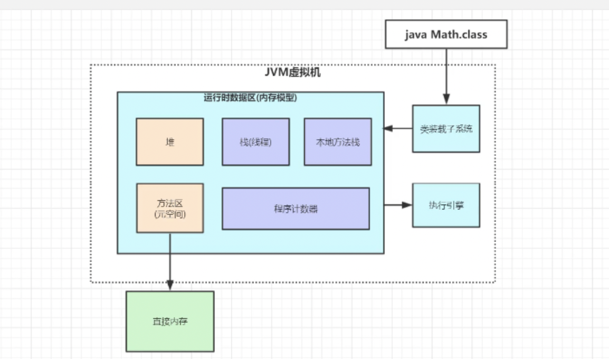
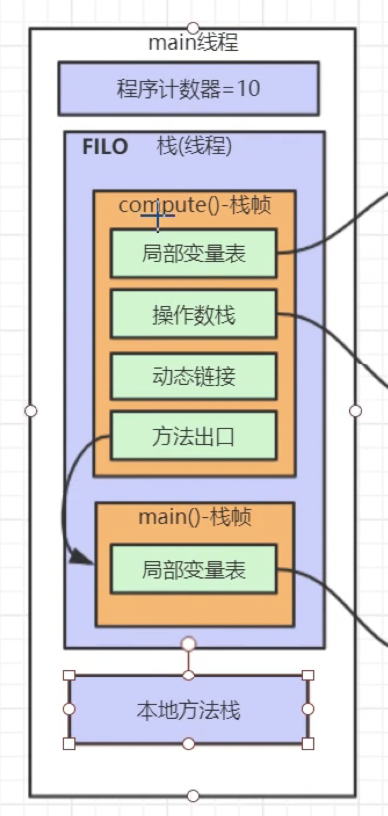

# 当日总节

> Date 11.41 pm

## 总线锁

cpu从主存读到缓存的时候，总线会加一个针对该缓存区域的锁，来自其他cpu的请求或者总线代理的请求将被阻塞。无法读取该数据直到数据被释放锁（这个是一个低性能的方案）为了数据安全还是会用到总线锁。

## MESI

当变量所处的内存区域是在一个缓存行当中,使用的是缓存行锁。定义就是mesi的协议(见2019-11-16相关文档)，当缓存行锁无效后会采用总线锁。

## jMM

### 类加载顺序

一个java文件从被加载到被卸载这个生命过程，总共要经历5个阶段，JVM将类加载过程分为：　　
    加载->链接（验证+准备+解析）->初始化（使用前的准备）->使用->卸载

#### 加载

首先通过一个类的全限定名来获取此类的二进制字节流；其次将这个字节流所代表的静态存储结构转化为方法区的运行时数据结构；最后在java堆中生成一个代表这个类的Class对象，作为方法区这些数据的访问入口。总的来说就是查找并加载类的二进制数据。

#### 链接

*　验证：确保被加载类的正确性；
*　准备：为类的静态变量分配内存，并将其初始化为默认值；
*　解析：把类中的符号引用转换为直接引用；

#### 类初始化数据

1. 如果这个类还没有被加载和链接，那先进行加载和链接
2. 假如这个类存在直接父类，并且这个类还没有被初始化（注意：在一个类加载器中，类只能初始化一次），那就初始化直接的父类（不适用于接口）
3. 加入类中存在初始化语句（如static变量和static块），那就依次执行这些初始化语句。
4. 总的来说，初始化顺序依次是：（静态变量、静态初始化块）–>（变量、初始化块）–> 构造器；如果有父类，则顺序是：父类static方法 –> 子类static方法 –> 父类构造方法- -> 子类构造方法
